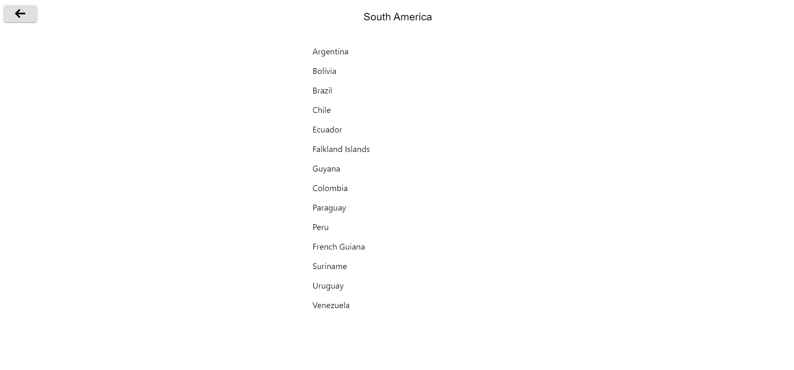
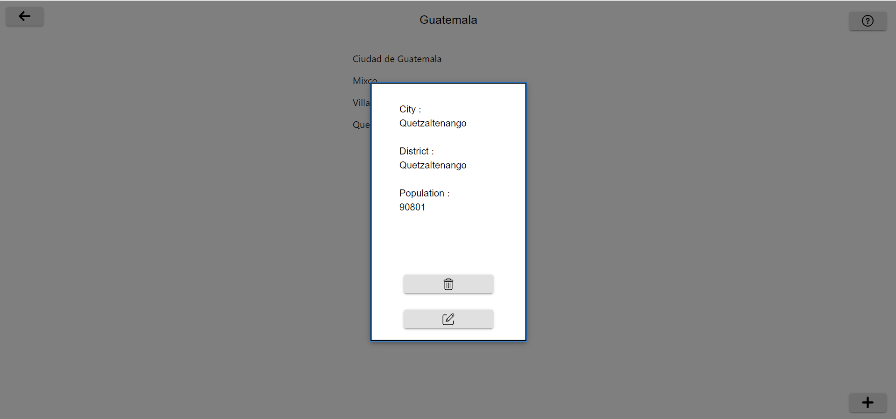
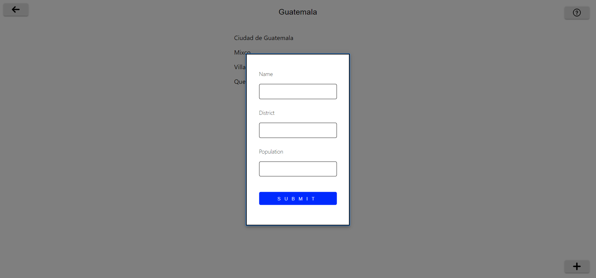
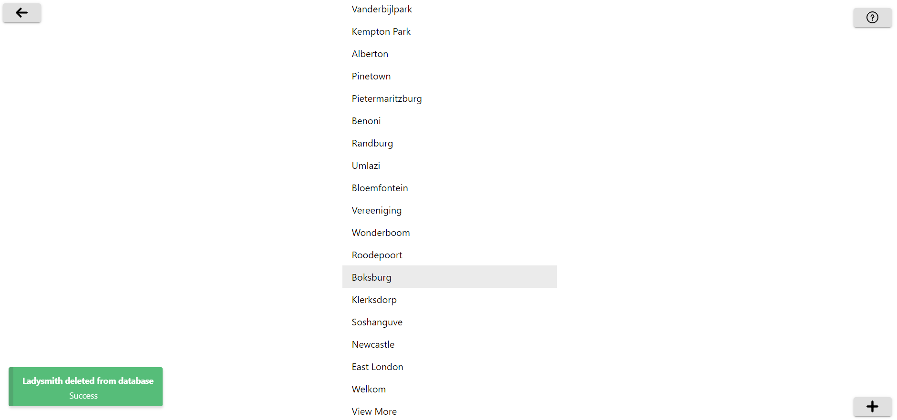
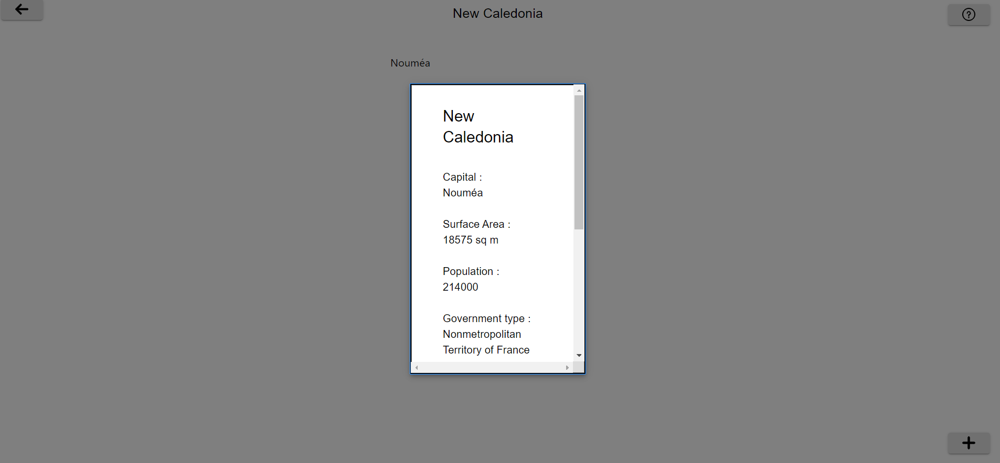

### Web App Description:

I have made a simple hierarchical list of our world with the following flow:

continents -> regions -> countries -> cities

This app keeps track of the user search order so that we could go back. Once the user selects the country, the user can add, delete and edit the city like city name, district and population. If there is an action done on the city, a notification will pop up indicating the changes persisted on the database. In order to keep performance in line, the results are paginated starting with regions.

### Deployment:

Importing world database

1. Ensure postgres software is installed on windows/linux.
2. Create a new postgres database with the desired database name.
3. Run `cd PATH-TO-POSTGRES-BIN-FOLDER`.
4. Run `psql -U USERNAME --file=PATH-TO\database\world.sql DESIRED_DATABASE_NAME`.

Backend
1. Change database parameters inside `backend/app.py` if needed.
2.
```shell
python -m venv python-backend
python-backend\Scripts\activate
cd backend
pip install -r requirements.txt
python app.py
```
Frontend:
1. Change server url if needed in `frontend/src/parameters/parameters.js`
2.
```shell
cd frontend
npm install
npm start
```

### Screenshots

App on web:


City info:


Edit screen:


Persist change in database:


Country info:

